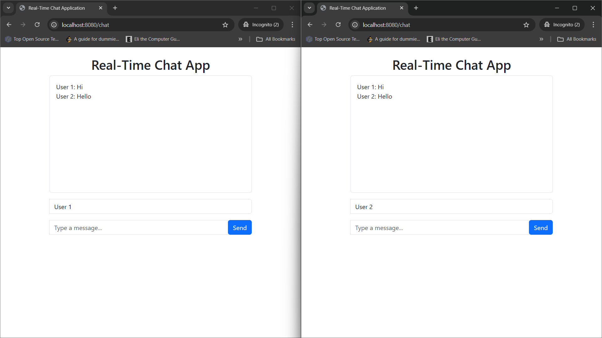

# Real-Time Chat Application (Spring Boot)

A real-time web-based chat application built using Spring Boot and WebSocket technology, enabling multiple users to communicate instantly through a browser-based interface.
The application uses STOMP over WebSocket with SockJS fallback support, a server-rendered frontend using Thymeleaf, and a responsive UI built with HTML and Bootstrap.



## Features
- Real-time messaging using WebSockets
- STOMP-based message broker architecture
- SockJS fallback for browsers without native WebSocket support
- Simple and responsive user interface
- Server-side rendering with Thymeleaf
- Lightweight and easy to extend

## Tech Stack
**Backend**
- Java
- Spring Boot
- Spring Web
- Spring WebSocket
- STOMP Protocol
- Lombok
  
**Frontend**
- HTML5
- Bootstrap
- Thymeleaf
- JavaScript

**Additional technologies used:**
- STOMP for structured messaging
- SockJS for WebSocket fallback support

## Architecture Overview
- Clients connect to the server via WebSocket endpoints.
- Messages are sent using the STOMP protocol.
- The server broadcasts messages to subscribed clients.
- SockJS ensures compatibility across different browsers.
- Thymeleaf renders the initial UI, while JavaScript handles live message updates.

## Running the Application

1. Clone the repository:
```bash
git clone https://github.com/sonjyoti/Real-Time-Chat-App.git
```

2. Navigate to the project directory:
```bash
cd Real-Time-Chat-App/app
```

3. Run the application:
```bash
mvn spring-boot:run
```

4. Open your browser and visit:
```bash
http://localhost:8080
```

## Possible Enhancements
- User authentication and authorization
- Private (one-to-one) messaging
- Message persistence using a database
- Online/offline user status
- Typing indicators
- Message timestamps and read receipts

## Learning Outcomes

_This project demonstrates:_
- Practical use of Spring Boot WebSockets
- Real-time messaging with STOMP
- Client-server communication patterns
- Integration of frontend and backend in a single application
- Server broadcasts messages to subscribed topics.
- All connected clients receive updates in real time.
